# Community Shaders Particle Lights Fork Installation Guide

For **Skyrim VR / MGO** users setting up the Particle Lights fork, Wetterness, Upscaling, and VR FOV.

## Index

- [Installation](#installation)
  - [1. Download the Latest Version](#1-download-the-latest-version)
  - [2. Install in MO2](#2-install-in-mo2)
  - [3. Check Overwritten Files](#3-check-overwritten-files)
  - [4. Disable Old Overwritten Features](#4-disable-old-overwritten-features)
  - [5. SE/AE Only: Install Optional CS Features](#5-seae-only-install-optional-cs-features)
  - [6. Why Old Features Turn Red](#6-why-old-features-turn-red)
  - [7. VR AIO Summary](#7-vr-aio-summary)
  - [8. Update SKSE VR Address Library](#8-update-skse-vr-address-library)
  - [9. Startup Errors](#9-startup-errors)
  - [10. Clear Shader Cache](#10-clear-shader-cache)
  - [11. Start Skyrim VR](#11-start-skyrim-vr)
  - [12. Open the CS Menu](#12-open-the-cs-menu)
- [Community Shaders First Setup](#community-shaders-first-setup)
  - [Menu Basics](#menu-basics)
  - [Setup Upscaling](#setup-upscaling)
  - [VR Only: Setup FOV](#vr-only-setup-fov)
  - [Measure Performance](#measure-performance)
  - [Optional VR Pages](#optional-vr-pages)
    - [VR Stereo](#vr-stereo)
    - [VR Shadowmap Rasterizer](#vr-shadowmap-rasterizer)
    - [VR Bindings](#vr-bindings)
  - [Recommended Visual Feature Pages](#recommended-visual-feature-pages)
    - [Light Limit Fix / Particle Lights](#light-limit-fix-particle-lights)
    - [Terrain Blending](#terrain-blending)
    - [Screen Space Shadows](#screen-space-shadows)
    - [Screen Space GI](#screen-space-gi)
    - [Wetterness](#wetterness)
    - [Skylighting](#skylighting)
  - [Performance Optimization](#performance-optimization)
  - [Complex Material / Ice Mesh Wobble](#complex-material-ice-mesh-wobble)
- [Final Notes](#final-notes)

---

## Installation

> [!IMPORTANT]
> **VR users:** The current **Community Shaders Particle Lights VR** file is an **all-in-one** Community Shaders package. For CS itself, install only this AIO file. Do not download or keep separate Community Shaders feature files from Nexus under it; old feature files can overwrite newer AIO files and break shader compilation.

> [!NOTE]
> **SE/AE users:** The SE/AE Particle Lights fork is **not** all-in-one. SE/AE users still need the separate Community Shaders feature downloads they want to use, matched to the correct feature versions for their CS/fork base.

### 1. Download the Latest Version

Download the latest version of **Community Shaders - Particle Lights Fork** from Nexus:

**Community Shaders - Particle Lights (Unofficial Fork)**  
https://www.nexusmods.com/skyrimspecialedition/mods/166950

For VR, download:

```text
Community Shaders Particle Lights VR
```

This is the AIO file. No other CS feature package is required for the VR setup described in this guide. Required support mods such as VR Address Library and Engine Fixes VR still apply.

For SE/AE, download:

```text
Community Shaders Particle Lights SE
```

This is not an AIO file. SE/AE users must add the separate CS feature downloads they want to use, using versions appropriate for their base CS/fork version.

Please also read the full mod description and the sticky post in the comments section, as these usually contain the most up-to-date information, known issues, and version-specific notes:

https://www.nexusmods.com/skyrimspecialedition/mods/166950?tab=posts

### 2. Install in MO2

Install the downloaded **.7z** file with **Mod Organizer 2**.

In your MO2 left pane, move the newly installed file directly **above** your existing **Community Shaders Unofficial Fork** mod in the Community Shaders section of MGO. The old fork will be disabled in the next steps.


### 3. Check Overwritten Files

Click on the newly installed **Community Shaders Particle Lights VR** file in MO2.

You will now see that several Community Shaders feature mods below it turn **red**. This means these files are being overwritten by the new fork/core package.


### 4. Disable Old Overwritten Features

Untick all red Community Shaders feature mods that are now overwritten.

Also untick the old **Community Shaders Unofficial Fork** file.


> **Important:** Do not keep old overwritten feature files active below the new fork. Otherwise, they can overwrite newer files and cause shader compile errors, missing features, or unexpected graphical issues.

### 5. SE/AE Only: Install Optional CS Features

VR users can skip this step. The VR AIO already contains the CS feature stack used by this guide.

SE/AE users should install only supported CS feature packages from Nexus, with feature versions matching the CS/fork base they are using. Do not mix old legacy feature files into a current setup.

Official CS 1.5.2 feature split:

https://www.nexusmods.com/skyrimspecialedition/mods/86492

For official **Community Shaders 1.5.2**, the Nexus page lists these as already included in the main download:

```text
Extended Materials
LOD Blending
Performance Overlay
Volumetric Lighting
Weather Picker / Weather Editor
Dynamic Cubemaps
Light Limit Fix
Terrain Shadows
Inverse Square Lighting
Water Effects
Interior Sun
Extended Translucency
Screen Space Shadows
Grass Collision
Grass Lighting
Subsurface Scattering
```

For official **Community Shaders 1.5.2**, these remain separate optional downloads:

```text
Cloud Shadows
Hair Specular
HDR
Screen Space Global Illumination (SSGI)
Sky Sync
Skylighting
Terrain Helper
Terrain Blending
Terrain Variation
Upscaling
Wetness Effects
```

Anything outside the supported current list should not be installed. If you use the SE/AE Particle Lights fork instead of official CS 1.5.2, match the feature versions required by that fork/base version, not random newer or older files.


Not every optional feature is required. Install only the feature pages you actually want to use.

> [!NOTE]
> Good practice when updating CS during an existing playthrough is to make an interior save first, then update. If you experience hang-ups or an indefinite loading screen after a CS update, untick **Enable Async** in **CS UI > General > Shaders**.

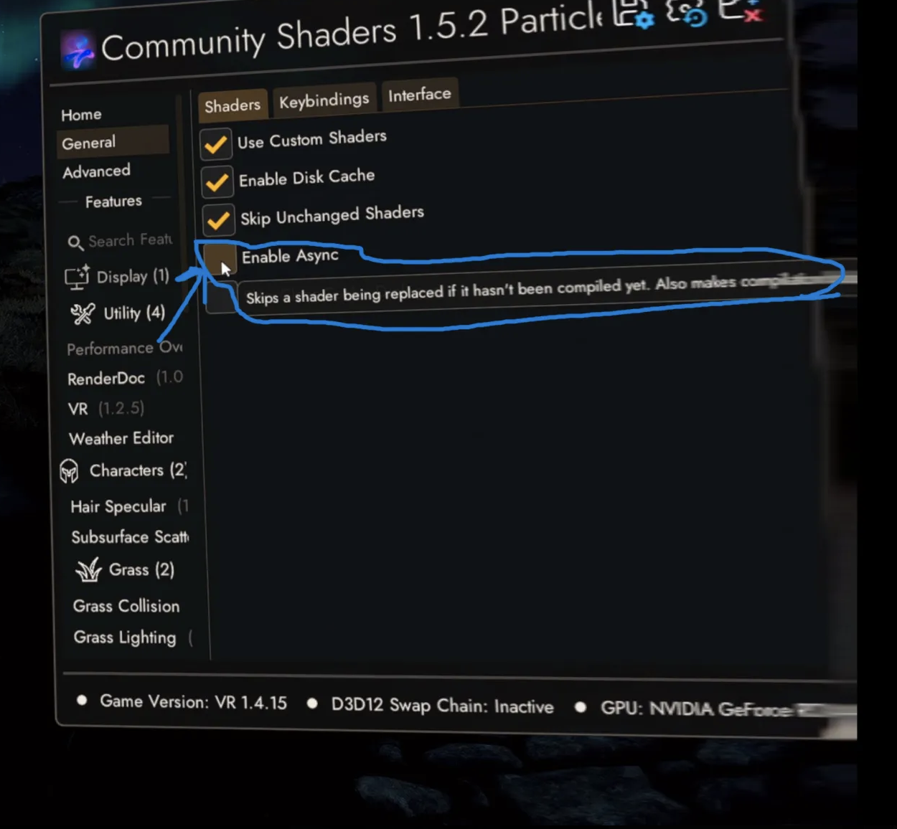

### 6. Why Old Features Turn Red

Community Shaders used to provide many features as separate downloads. This was useful because it gave individual features more visibility and acknowledged the work of different contributors.

However, separate feature plugins can also make development and compatibility more difficult. Because of this, the Community Shaders team has moved several features back into the main Community Shaders core file.

This is why, compared to older CS 1.4.6-based setups, features such as **Inverse Square Lighting** and several others may now turn red in MO2 when you select the main file.

That usually means:

- The feature is already included in the main Community Shaders file.
- The old separate feature below it would overwrite newer core files.
- The old separate file should be disabled.

Disable these old separate files if they are already included in the new core package.


### 7. VR AIO Summary

Because the **Community Shaders Particle Lights VR** file is now an AIO, it already includes the VR-focused feature stack used later in this guide, including Upscaling/FOV, Wetterness, Light Limit Fix / Particle Lights, Terrain Blending, Screen Space Shadows, Screen Space GI, Skylighting, Volumetric Lighting, and the other CS menu pages shown below.

This means you no longer need to download and install those CS features separately for VR. If your old modlist still contains separate CS feature files below the AIO, leave them disabled unless the current fork description explicitly says otherwise.

### 8. Update SKSE VR Address Library

Update **SKSE VR Address Library**:

https://www.nexusmods.com/skyrimspecialedition/mods/58101

This is required for many SKSE/CommonLib-based plugins to work correctly.

### 9. Startup Errors

When starting Skyrim VR through MO2, you may see an error message.

This usually means one of the following:

- You forgot to update **SKSE VR Address Library**.
- You also need to update **Light Placer**.
- You also need to update **Light Placer VR**.
- You have an incompatible DLL/mod installed.

Check compatibility on the Particle Lights fork description page:
https://www.nexusmods.com/skyrimspecialedition/mods/166950?tab=description

Update these two mods if needed:

**Light Placer**  
https://www.nexusmods.com/skyrimspecialedition/mods/127557

**Light Placer VR**  
https://www.nexusmods.com/skyrimspecialedition/mods/135822

> **Important:** **Light Placer** and **Light Placer VR** must have the same version number.

Example:

```text
Light Placer 4.2.0
Light Placer VR 4.2.0
```

These updates should be safe to make during an existing playthrough. Only update them if you get the error message or if the new fork specifically requires it.

### 10. Clear Shader Cache

Before starting the game, clear the shader cache from MO2.

Go to the **Overwrite** folder at the bottom of MO2.


You can either press **Clear Overwrite** and delete the contents, or, more safely:

1. Right-click **Overwrite**.
2. Choose **Open in Explorer**.
3. Delete only the **ShaderCache** folder manually.

> **Recommended:** If you use mods that store configuration files in Overwrite, it is safer to open the folder manually and delete only the shader cache.

Deleting the shader cache is 100% sufficient for a new Community Shaders install.

If you accidentally clear the whole Overwrite folder, do not panic. The shader cache folder is regenerated when Skyrim VR starts.

Modlists often integrate their CS user configuration file (`SettingsUser.json`) as a mod. In that case, your Community Shaders configuration file is saved in that dedicated MO2 mod instead of only in Overwrite.

The important point is:

- Your CS settings are saved in these MO2 configuration mods.
- Deleting Overwrite does not normally remove your saved CS settings in MGO.
- You do not have to do anything special here.

### 11. Start Skyrim VR

Start **Skyrim VR** through MO2.

> **Very important:** When the game starts, Community Shaders will compile shaders.

You must let this finish completely before starting your game.

Do not load into the game too early. If you do, you may see graphical artefacts, broken effects, or shader failures.

Depending on your CPU, shader compilation can take around:

```text
5-20+ minutes
```

During this time, your PC may become slow or temporarily unresponsive. Shader compilation can behave like a CPU stress test, especially on CPUs with fewer cores or limited cooling.

Just be patient and let it finish.

### 12. Open the CS Menu

While waiting, you can press the **END** key to open the Community Shaders menu.

At the bottom of the menu, you may see **Unified Water** listed in grey as an unloaded mod. You may also see a red warning elsewhere in the UI.

This is normal.

Unified Water is already indexed by Community Shaders, but the actual feature does not yet exist as a released mod. This warning does not affect any functional feature.

You can now customise Community Shaders according to your own performance and graphical preferences.

My recommendations below are based on my own system:

```text
Ryzen 9800X3D
RTX 4090
```

If your system is weaker, you may need to reduce some settings.

You can press **END** at any time in-game to open or close the CS menu. Many changes can be previewed in real time.

> **Reminder:** Only start playing once all shaders have compiled.

---

## Community Shaders First Setup

Do not try to tune every page on the first launch. Set up the core systems first, test them, then come back to the optional visual pages.

Practical order:

1. Check the Home page, shader settings, and keybindings.
2. Setup Upscaling for your GPU.
3. VR only: set up VR menu behavior and the shared FOV mask.
4. Use the Performance Overlay to compare frametime.
5. Tune optional visual features only after the core setup works.

The screenshots below use the current UI. The text gives high-level guidance only; hover the controls in game for exact tooltips, requirements, value ranges, and restart warnings.

After changing settings, use the save icon in the menu header. Restart the game when a tooltip says a setting requires restart.

### Menu Basics

#### Home

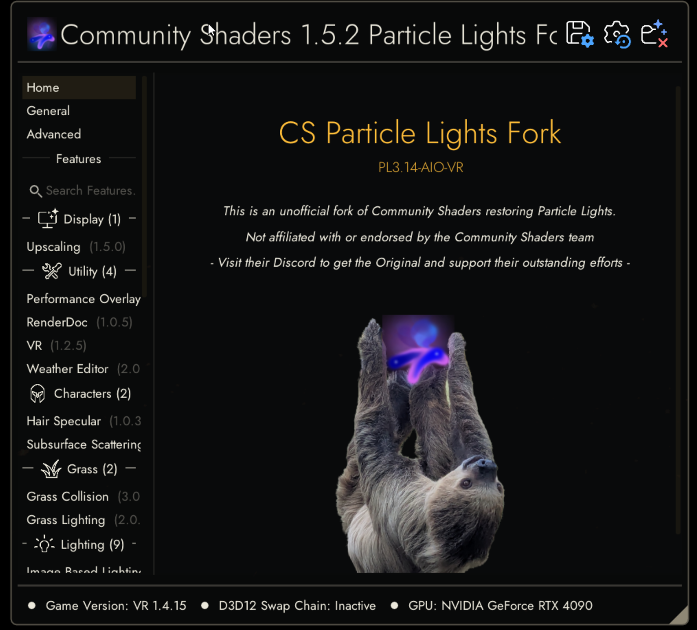

The **Home** page confirms that you are running the Particle Lights fork and shows the current fork/version information. Use the left feature list to move through the menu. The header icons are for common actions such as saving, loading/reloading settings, clearing cache, and closing the menu.

#### General > Shaders

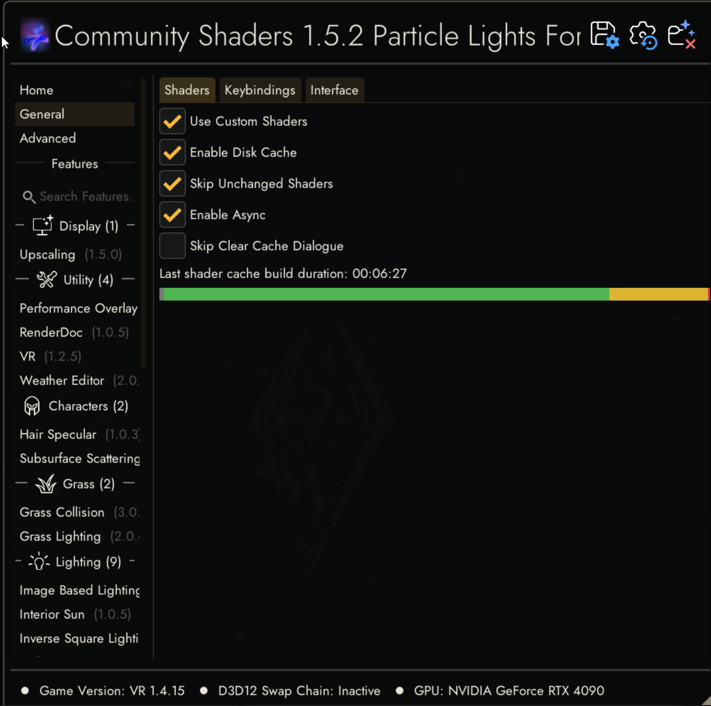

The **General > Shaders** tab controls the global shader system.

Recommended first-time setup:

```text
Use Custom Shaders: on
Enable Disk Cache: on
Skip Unchanged Shaders: on
Enable Async: on
Skip Clear Cache Dialogue: off unless you are testing repeatedly
```

The shader cache bar shows the last cache build result. Hover it in game to see the cache/compile breakdown. If you clear the shader cache, wait for compilation to finish before judging performance or visual quality.

#### General > Keybindings

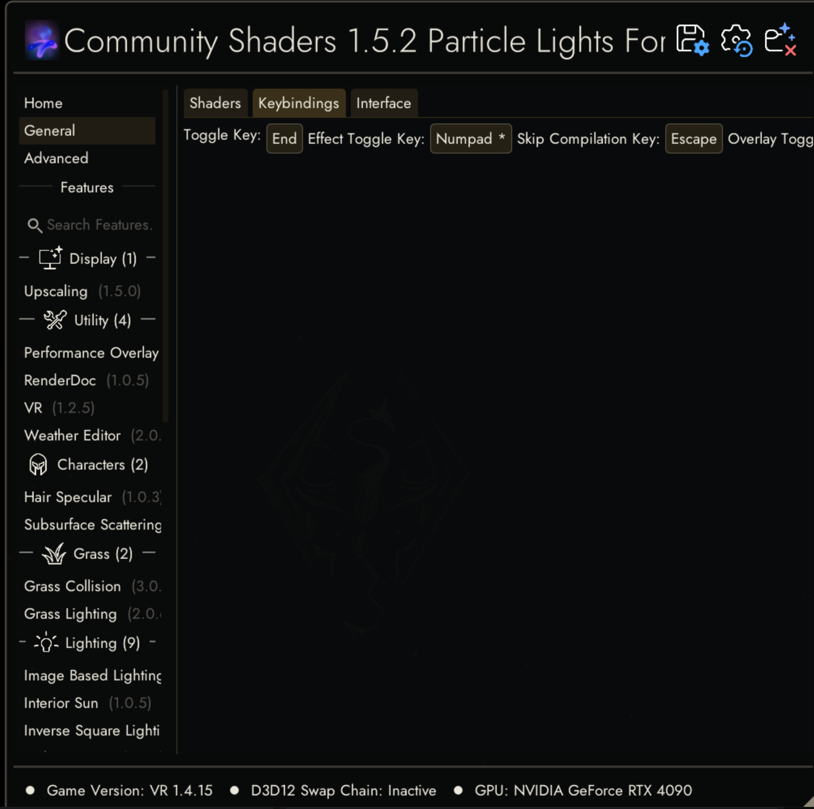

Use **General > Keybindings** for desktop keyboard shortcuts such as the Community Shaders menu toggle, effect toggle, skip compilation key, overlay toggle, and Weather Editor toggle. The default menu key is usually **END**. Change these only if they conflict with another mod or with your VR controller workflow.

### Setup Upscaling

#### Upscaling > NVIDIA DLSS

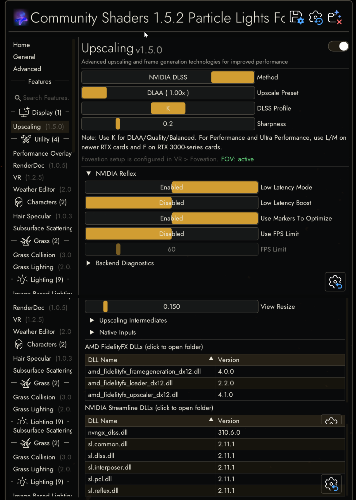

Open **Upscaling** to choose the upscaling backend, render scale, DLSS profile, sharpening, NVIDIA Reflex, and backend diagnostics.

Use the **Method** slider for your GPU:

```text
NVIDIA RTX:
Use NVIDIA DLSS.

AMD:
Use AMD FSR 4 if it is available.
If AMD FSR 4 is not shown, or if the runtime path is unavailable, use AMD FSR 3.1.5.

Other GPUs:
Use AMD FSR 3.1.5, or TAA if vendor upscaling causes problems.
```

If Community Shaders locks Upscaling to **None** because OpenComposite already has external upscaling enabled, disable the OpenComposite upscaler first, or use the OpenComposite upscaler instead of Community Shaders Upscaling.

Use **Upscale Preset** to choose the internal render scale:

```text
DLAA / Native AA      1.00x  best image quality, lowest performance gain
Hoshipa               0.85x  very high quality
Ultra Quality         0.77x  high quality
Quality               0.67x  recommended starting point
Balanced              0.59x  more performance, softer image
Performance           0.50x  only if you need more FPS
Ultra Performance     0.33x  last resort / very high headset resolution
```

Start with **Quality**. If you have enough performance, try **Ultra Quality**, **Hoshipa**, or **DLAA / Native AA**. If you are GPU-limited, try **Balanced** or **Performance**.

For **NVIDIA DLSS Profile**, the in-game tooltip gives the exact profile guidance. As a simple rule:

```text
DLAA / Quality / Balanced:
Profile K

Performance / Ultra Performance:
Profile L or M on newer RTX cards
Profile F on RTX 3000-series cards
```

For **Sharpness**, start around `0.1`. If the image is too soft, first try a higher **Upscale Preset** rather than using very high sharpening.

The **NVIDIA Reflex** section can reduce input latency and smooth CPU/GPU timing. **Low Latency Mode** is the normal useful option.

> **Warning:** **Low Latency Boost** can increase GPU power draw and heat. Use it only if your GPU and case cooling are strong enough; this requires excellent cooling and temperature monitoring while testing. I take no responsibility for overheating, instability, hardware damage, or users running unsafe cooling/power configurations.

#### Upscaling > AMD FSR and Diagnostics

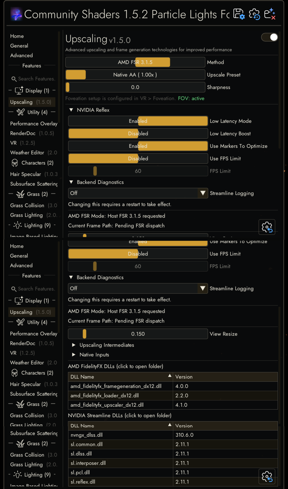

The AMD FSR view uses the same **Method**, **Upscale Preset**, and **Sharpness** idea. If **AMD FSR 4** is available in the **Method** list, use it first on supported AMD hardware. If it is not available or the runtime path fails, use **AMD FSR 3.1.5**.

The **Backend Diagnostics** section shows the current AMD FSR mode, current frame path, debug view resize, intermediate buffers, native inputs, and installed AMD FidelityFX / NVIDIA Streamline DLL versions. This is mostly for troubleshooting. For normal setup, use it only to confirm that the expected DLLs and runtime path are loaded.

In VR, this page also shows whether **FOV** is active. The actual FOV mask is configured in **VR > Foveation**, not on the Upscaling page.

### VR Only: Setup FOV

Non-VR users can skip this section.

#### VR > General

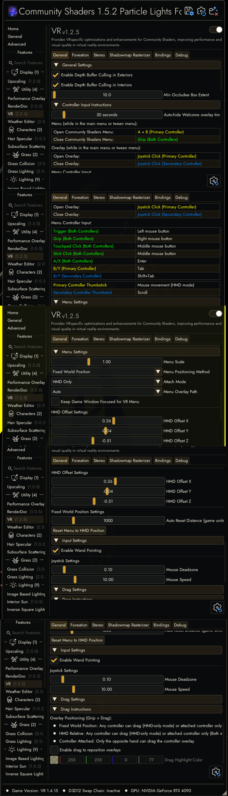

Open **VR > General** first. Keep both depth buffer culling options enabled:

```text
Enable Depth Buffer Culling in Exteriors: on
Enable Depth Buffer Culling in Interiors: on
```

The tooltip explains that these improve performance. **Min Occludee Box Extent** controls how aggressively small objects are culled. Lower values can save more performance but can also create visual artefacts, so leave it near the default unless you are testing carefully.

#### Keep the Desktop Window on Top

In **Menu Settings**, use:

```text
Keep Game Window Focused for VR Menu
```

Turn this **on** if the Community Shaders VR menu loses input, appears behind other desktop windows, or if Windows focus changes while you are trying to use the menu in the headset. While the CS menu is open, this forces the Skyrim VR desktop window to stay centered, foregrounded, and above other desktop windows.

This only applies when **Attach Mode** presents the menu in VR, such as **HMD Only**, **Controller Only**, or **Both**. It does not apply when **Attach Mode** is **None (Desktop Only)**.

To deactivate it, uncheck **Keep Game Window Focused for VR Menu**. The game window is then released again, so you can move it aside or use other desktop applications while the VR menu remains open. Closing the CS menu also stops the active window forcing until the menu is opened again.

The rest of the page controls the VR menu itself: controller instructions, menu scale, positioning mode, overlay path, HMD/controller offsets, wand pointing, mouse deadzone/speed, and drag repositioning. These are comfort and usability settings, not graphics-quality settings.

#### VR > Foveation

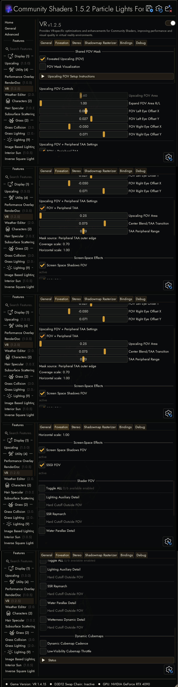

The VR FOV system uses one shared mask. **Foveated Upscaling (FOV)** works with **NVIDIA DLSS**, **AMD FSR 3.1.5**, and **AMD FSR 4**. It is not DLSS-only.

Upscaling uses this mask first, and other VR FOV features can reuse it later. This is why the mask must be set up before enabling shader/detail FOV options.

Enable:

```text
Foveated Upscaling (FOV)
FOV Mask Visualization
```

With mask visualization enabled:

```text
Green = expensive high-quality upscaling center
Gold = Peripheral TAA ring, if enabled
Blue/dark = cheaper outer area
```

Use the in-menu **Upscaling FOV Setup Instructions** together with this scheme:

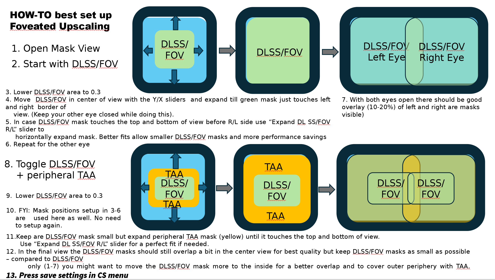

Recommended setup order:

1. Keep **FOV + Peripheral TAA** disabled at first.
2. Lower **Upscaling FOV Area** to around `0.25-0.30`.
3. Use the left/right eye X/Y offset sliders to place the green mask in the center of each eye.
4. Increase **Upscaling FOV Area** until the green mask touches the top and bottom of the visible HMD image.
5. Use **Expand FOV Area R/L** until the mask also reaches the left and right visible edges.
6. Check both eyes together. The left and right green masks should overlap slightly in the center.
7. Test in game. If the periphery shimmers too much, increase the green area.

If **Foveated Upscaling (FOV)** without Peripheral TAA needs a very large green area, try **FOV + Peripheral TAA**.

With **FOV + Peripheral TAA** enabled:

```text
Upscaling FOV Area:
Start around 0.30. Try 0.25 if stable.

Center Blend/TAA Transition:
Controls how soft the green-to-gold transition is.

TAA Peripheral Range:
Increase until the gold ring reaches the edge of your visible HMD field of view.
```

**FOV + Peripheral TAA** costs extra work, but it can allow a much smaller expensive green upscaling center. Use it only if the smaller center gives more performance than the added TAA cost.

After the mask is correct, turn off **FOV Mask Visualization**, save settings, and test normal gameplay.

#### Shader and Feature FOV

After the shared mask is tuned, you can enable additional FOV savings under **VR > Foveation**.

Screen-space options:

```text
Screen Space Shadows FOV:
Full-quality Screen Space Shadows inside the mask, fading outside it.

SSGI FOV:
Uses the shared mask for Screen Space GI.
```

Shader FOV options:

```text
Lighting Auxiliary Detail
SSR Raymarch
Water Parallax Detail
Wetterness Dynamic Detail
Dynamic Cubemap Cadence
Low-Visibility Cubemap Throttle
```

Use **Toggle ALL** only after the shared mask is correct. It enables eligible shader/detail FOV features, but it does not change **Foveated Upscaling (FOV)**, **FOV Mask Visualization**, **FOV + Peripheral TAA**, or the separate **Screen Space Shadows FOV** / **SSGI FOV** options.

Hard cutoff options can save more performance, but transitions can become more visible near the mask edge. Enable hard cutoff only after the normal feathered mode looks stable.

#### When FOV Is Useful

FOV is useful only when it lowers GPU frametime more than its own overhead costs.

Compare these setups in the same scene:

```text
1. Upscaling without FOV
2. Foveated Upscaling (FOV), with the green mask expanded to cover the visible HMD field
3. FOV + Peripheral TAA, with a smaller green center and gold TAA ring
4. Additional Shader/Feature FOV options enabled
```

Keep the setup that gives the lowest stable frametime without visible shimmer, blur, or mask-edge artefacts.

For downstream FOV features, the active mask border matters:

```text
Foveated Upscaling (FOV) without Peripheral TAA:
Downstream features use the Upscaling FOV center border.

FOV + Peripheral TAA:
Downstream features use the Peripheral TAA outer border.
```

So if Peripheral TAA is enabled, the yellow outer edge becomes the important boundary for later shader/detail FOV savings. If the TAA range is very large, downstream FOV features save less. If it is too small, transitions may become visible. Balance image stability against frametime.

### Measure Performance

#### Performance Overlay

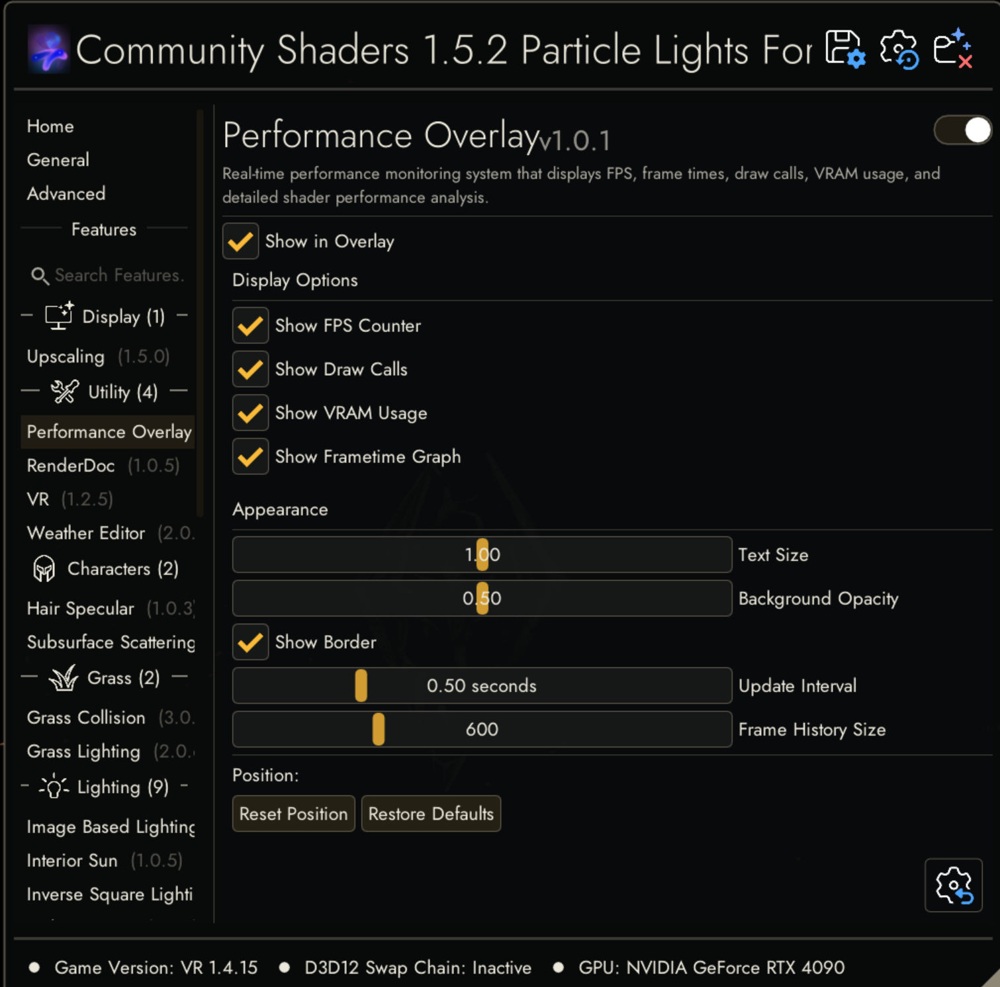

The **Performance Overlay** is the easiest way to compare settings in the same scene. Enable **Show in Overlay**, **Show FPS Counter**, **Show VRAM Usage**, and **Show Frametime Graph** while testing.

Use this overlay when comparing:

```text
Upscaling presets
Foveated Upscaling (FOV)
FOV + Peripheral TAA
Screen Space Shadows FOV
SSGI FOV
Wetterness presets
```

The display and appearance controls only affect the overlay itself. Use a long enough **Frame History Size** to see spikes while turning, loading new LODs, or entering heavy rain.

### Optional VR Pages

These pages are useful, but most users do not need to change them immediately.

#### VR: Stereo

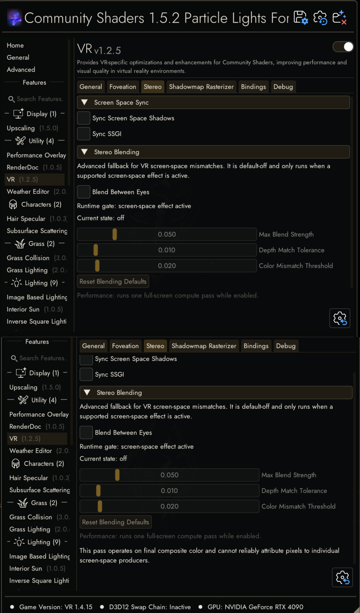

The **Stereo** tab contains VR-specific fixes for screen-space effects that can mismatch between eyes. The screen-space sync options reuse shared resources so supported effects line up better in stereo.

The **Stereo Blending** section is an advanced fallback. It blends between eyes after the final composite to hide remaining screen-space mismatches, but it costs a full-screen compute pass while active. Leave it off unless you see a specific stereo artefact and the tooltip suggests it applies to your case.

#### VR: Shadowmap Rasterizer

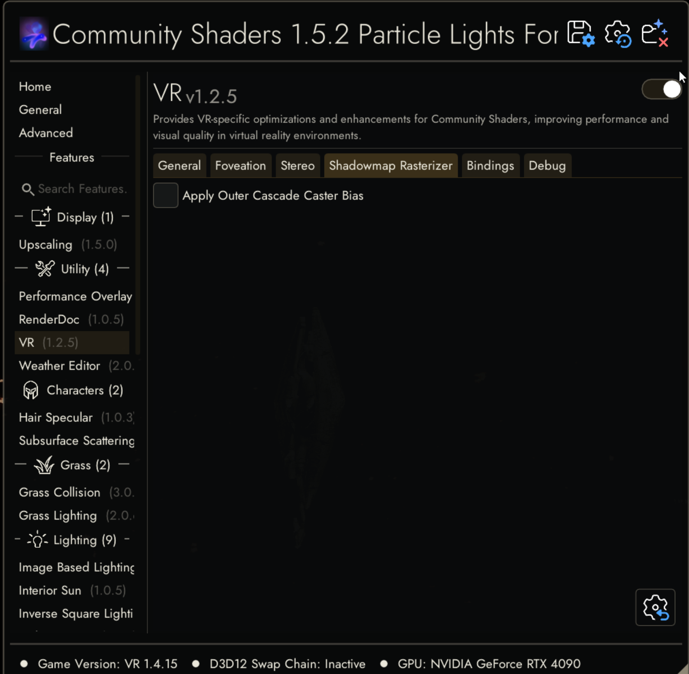

**Apply Outer Cascade Caster Bias** is default-off and should stay off unless distant or outer-cascade surfaces show shadow acne. The tooltip warns that enabling it can cause detached shadows, pulsing, or flicker if your shadows are already stable.

#### VR: Bindings

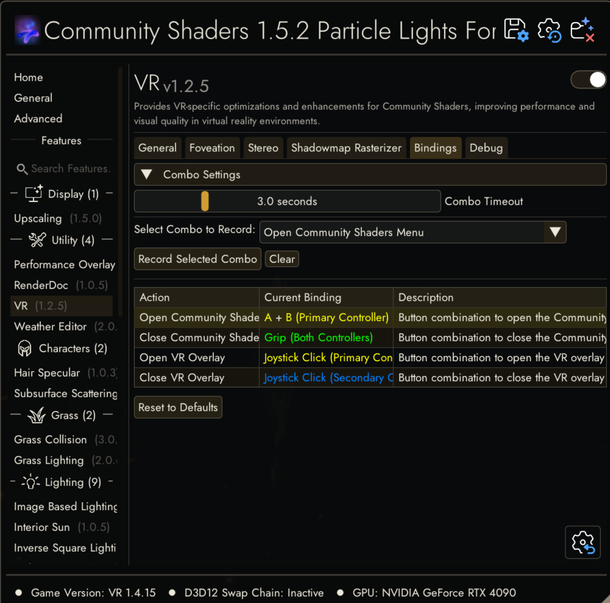

The **Bindings** tab lets you record controller button combinations for opening and closing the Community Shaders menu and VR overlay. Increase **Combo Timeout** if you need more time to press multi-button combos.

Use **Record Selected Combo** only when you are ready to change the selected action. The table shows the current binding and description for each action.

### Recommended Visual Feature Pages

These pages are optional. Start with the features you actually care about, test one change at a time, and use the Performance Overlay to compare the same scene before and after.

The strongest first choices are usually **Light Limit Fix / Particle Lights**, **Terrain Blending**, **Screen Space Shadows**, **Screen Space GI**, and **Wetterness**. The remaining pages are more specialized tuning.

#### Light Limit Fix: Particle Lights

The **Light Limit Fix** page is especially important in this fork because it contains the restored **Particle Lights** controls, the returned **Contact Shadows** controls, in-game placed-light intensity scaling, and the **Heat Warp Strength** slider.

> **Important in this version:** Particle Lights are back, **Contact Shadows** are back, **Placed Lights (JSON) > Intensity Scale** can be adjusted in game, and **ImageSpace Refraction > Heat Warp Strength** can now be tuned directly from the menu.

**Particle Lights** are dynamic lights generated from particle effects such as fire, embers, sparks, magic effects, smoke-like emitters, and similar VFX. Instead of relying only on a static hand-placed light in a cell, the light can follow the actual particle effect. This makes fire and magic effects feel more connected to what you see on screen, especially when the effect moves, flickers, changes colour, or appears only temporarily.

Compared with placed lights, Particle Lights have several advantages:

```text
They follow the visible effect instead of staying fixed in one cell position.
They can react to animated particles, moving effects, and temporary effects.
They reduce the need for many manually placed helper lights.
They often avoid the mismatch where a placed light remains bright while the visible effect is small, gone, or elsewhere.
```

Placed lights are still useful for static lighting design, interiors, candles, torches, windows, and authored scene lighting. Particle Lights are best understood as a companion system: placed lights shape the scene, while Particle Lights make visible effects emit light more naturally.

For the **Particle Lights** section, start with:

```text
Enable Particle Lights: on
Enable Culling: on
Enable Detection: on if you want particle lights to affect stealth detection
Enable Optimization: on
```

The performance controls are:

```text
Cluster Threshold
Max Particles per Emitter
Max Particle Distance
```

Higher **Cluster Threshold** merges more nearby particles into fewer lights, which is faster but less precise. Lower values preserve more detail but cost more. **Max Particles per Emitter** limits how many particles are sampled from dense effects. **Max Particle Distance** skips far-away particle lights completely, which is useful in VR.

The visual controls are:

```text
Saturation
Particle Brightness
Particle Radius
Billboard Brightness
Billboard Radius
```

Use **Particle Brightness** and **Particle Radius** first. If particle lights feel too colourful, lower **Saturation**. If the visible particle billboard and the emitted light no longer match, adjust **Billboard Brightness** and **Billboard Radius** carefully.

The **Placed Lights (JSON)** section lets you regulate the intensity of placed runtime lights in game:

```text
Intensity Scale
Interiors Only
Portal Strict Only
```

**Intensity Scale** mainly targets Light Placer-style JSON lights and requires the runtime metadata from **Inverse Square Lighting** to identify those lights. This is useful when a modlist has good placed lights but they are too strong, too weak, or too bright in VR.

For handling actual light conflicts in the load order, use my light conflict helper mod:

https://www.nexusmods.com/skyrimspecialedition/mods/175086

This version also brings back **Contact Shadows**:

```text
Enable Point Light Contact Shadows
Enable Particle Contact Shadows
Quality
Cached Lights per Cluster
Strict Light Budget
Particle Budget per Cluster
```

Contact shadows add short local shadows from point lights and particle lights, grounding objects near flames, lamps, magic effects, and other local lights. They add depth, but they also add cost. In VR, keep the budgets conservative and compare frametime with the Performance Overlay before raising quality.

At the top of the page, **ImageSpace Refraction** contains:

```text
Heat Warp Strength
```

This controls the heat shimmer / refraction strength around fire and heat sources. Lower it if the warp is distracting, too strong in VR, or causes discomfort. Set it to `0` if you want to disable the heat-warp effect completely.

#### Terrain Blending

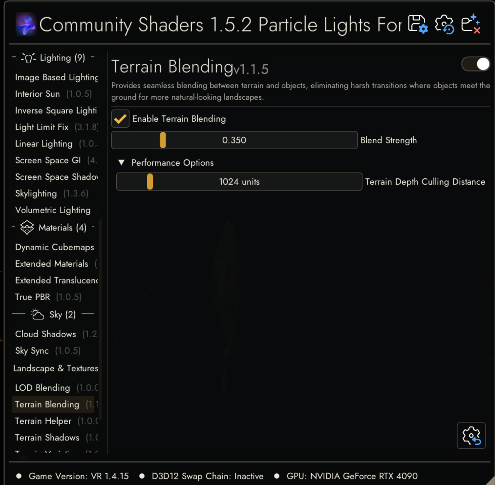

**Terrain Blending** is one of the easiest visual wins. It makes objects blend more naturally into the ground and removes many harsh object/terrain intersections. On my system it costs roughly `0.3 ms`.

**Blend Strength** controls how strong the blend is. For performance, use **Terrain Depth Culling Distance**:

```text
1024 = good starting point
512  = a little more FPS if you can tolerate more culling
```

#### Screen Space Shadows

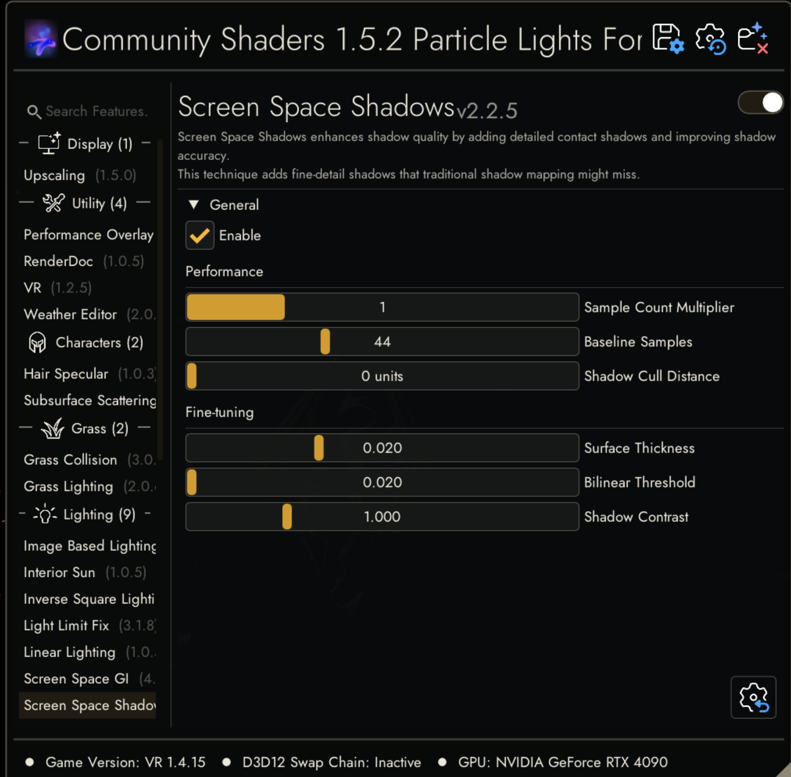

**Screen Space Shadows** adds contact-style shadow detail. On my system it costs roughly `0.4 ms`.

The main performance controls are **Sample Count Multiplier**, **Baseline Samples**, and **Shadow Cull Distance**. For VR, try a **Shadow Cull Distance** around:

```text
10000
```

This can reduce far-distance artefacts and save some performance. Use **Screen Space Shadows FOV** from **VR > Foveation** after the shared mask is correct.

#### Screen Space GI

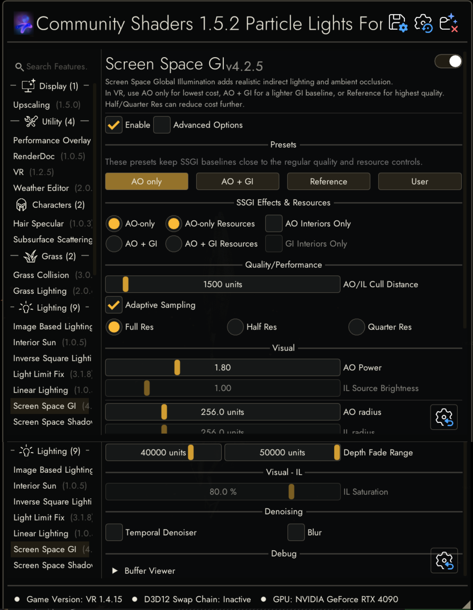

**Screen Space GI** is best used as **AO only** in VR. As a planning value, assume **AO only** costs roughly `1.0 ms`. Do not enable GI/IL for normal VR gameplay; it costs more and is usually not worth the frametime loss in the headset.

The top-level page includes **Enable**, **Advanced Options**, **Vanilla SSAO**, presets, AO/GI resource controls, and quality/performance controls.

For VR, a good first setup is:

```text
Enable: on
AO: on
AO Interiors Only: on if you want lower outdoor cost
GI/IL: off
AO/IL Cull Distance: lower if you need more performance
Adaptive Sampling: useful for reducing wasted work
```

Set the resource controls accordingly: enable the AO resources only and leave GI/IL resources disabled. If the page has an **AO only** preset, use that as the VR starting point.

Use **SSGI FOV** only after the shared mask in **VR > Foveation** is correctly tuned. With SSGI FOV enabled, SSGI is computed inside the shared mask and skipped outside it.

#### Screen Space GI: Advanced Options

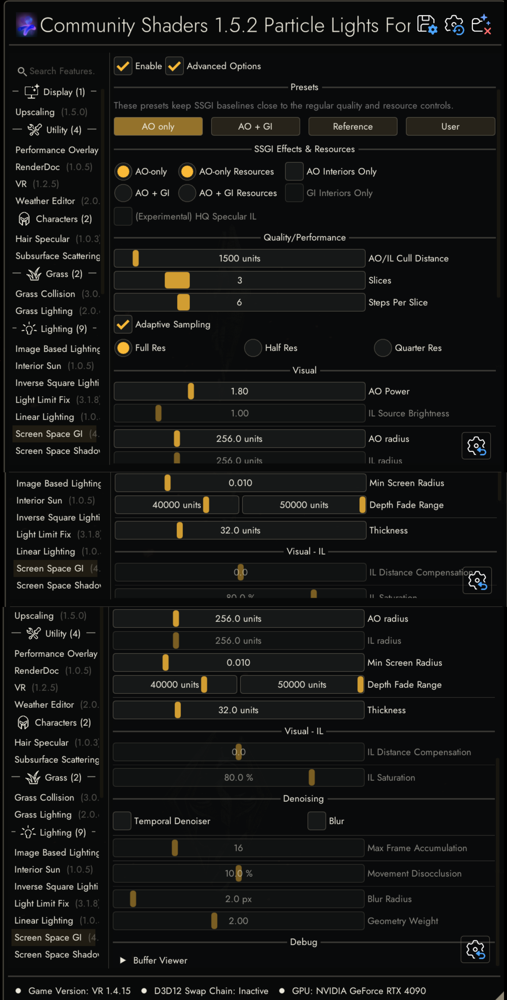

The advanced SSGI page exposes the detailed visual and denoising controls: AO power, IL brightness, AO/IL radius, depth fade, thickness, IL saturation, temporal denoiser, blur, frame accumulation, disocclusion, and debug buffer viewing.

Use the presets first. Only tune advanced controls if you are fixing a visible issue such as too much darkening, too much indirect color, flicker, ghosting, or excessive blur.

#### Wetterness

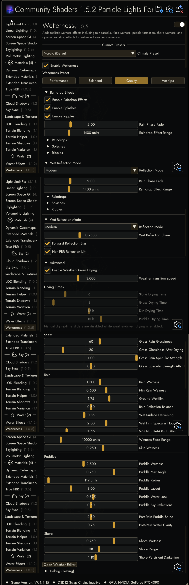

**Wetterness** controls rain film, puddles, shore wetness, drying behavior, raindrop splashes, ripples, and wet reflection style. It is usually cheap when dry, but in heavy rain and storms it can cost up to roughly `2.0 ms`.

Start with the **Climate Preset** and **Wetterness Preset** instead of tuning every slider manually. The visible sections cover:

```text
Enable Wetterness
Wetterness Preset
Raindrop Effects
Wet Reflection Mode
Advanced drying and weather response
Rain, puddle, shore, skin, and debug controls
```

Wet grass is controlled here too. In the **Grass** subsection, use **Grass Rain Glossiness** and **Grass Rain Specular Strength** to set how shiny grass becomes during rain. The matching **Grass Glossiness After Drying** and **Grass Specular Strength After Drying** sliders control the dry/post-rain baseline.

These rain and dry values are linked by the weather model. When **Enable Weather-Driven Drying** is active, grass transitions from the rain values back toward the after-drying values over the configured **Grass Drying Time**.

These sliders use the same idea as **Grass Lighting**: **Glossiness** changes the tightness of the highlight, while **Specular Strength** changes how strong the highlight is. Increase both for wetter, shinier grass; lower them if grass looks too metallic or sparkly in VR.

The tooltip text is especially useful here because many controls behave differently during active rain, after rain, and near shorelines. If you need more performance in storms, reduce or disable raindrop effects, splashes, ripples, or use a lower Wetterness preset.

#### Subsurface Scattering

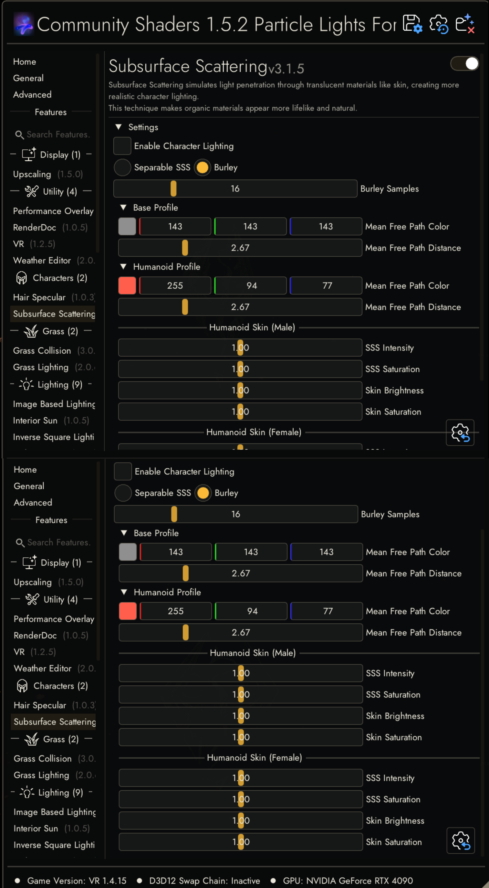

**Subsurface Scattering** controls skin and character light scattering. The visible sections cover character lighting strength, base/humanoid profiles, blur radius, thickness, Burley samples, mean free path color, and human skin tuning.

For normal gameplay, keep defaults unless skin looks too waxy, too flat, too saturated, or too bright. This page is mostly visual tuning, not a first-stop performance page.

#### Grass Lighting

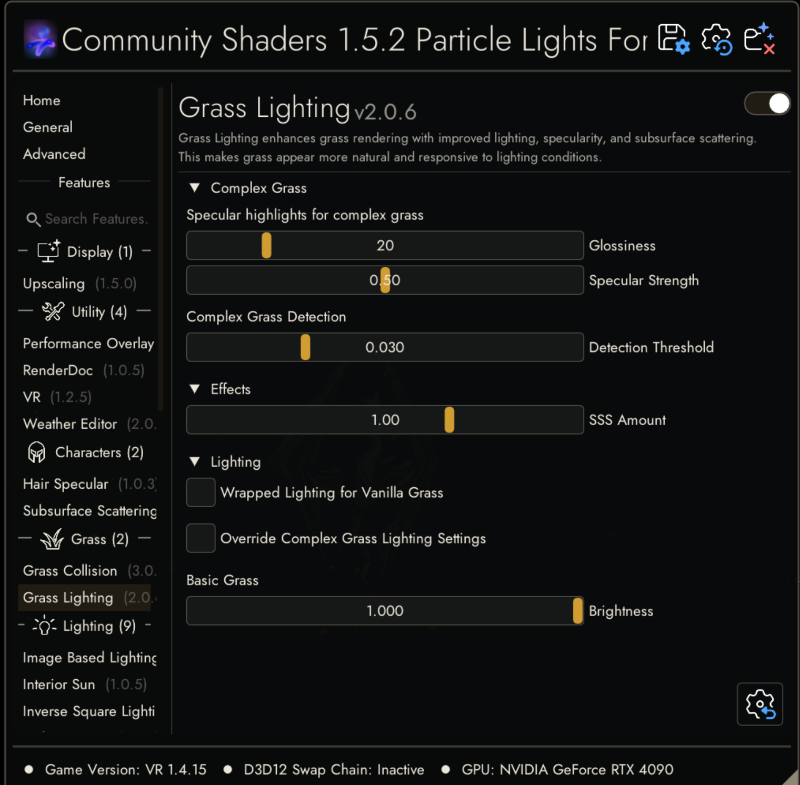

**Grass Lighting** improves grass specular highlights, complex grass detection, subsurface scattering on grass, wrapped lighting, and grass brightness.

This fork also keeps the **Wrapped Lighting for Vanilla Grass** toggle that was removed from the vanilla Nexus version. Enable it when you use vanilla-style grass or grass mods that still rely on vanilla grass lighting behavior. It softens direct lighting on grass blades, reduces harsh one-sided darkening, and helps grass sit more naturally in bright sunlight and low-angle lighting.

The most useful controls are **Wrapped Lighting for Vanilla Grass**, complex grass **Glossiness**, complex grass **Specular Strength**, and the basic grass brightness slider. Avoid large changes unless you are tuning a specific grass mod.

#### Skylighting

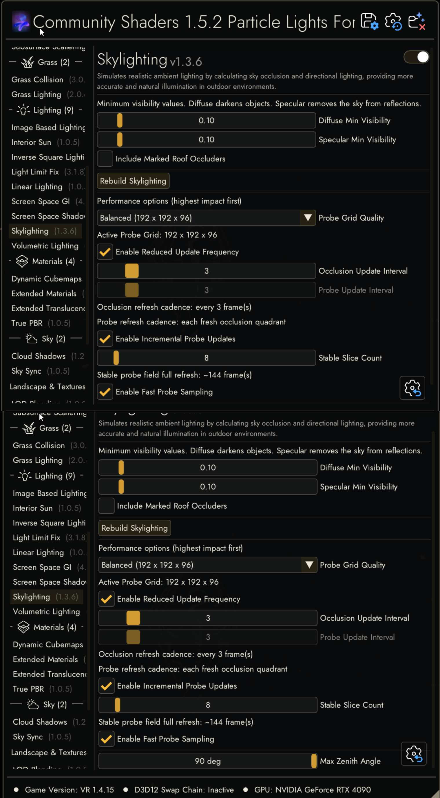

**Skylighting** controls probe-based sky and ambient lighting. At good visual settings, assume it can cost roughly `1.5 ms` in VR, so treat it as a quality feature.

Important controls include **Diffuse Min Visibility**, **Specular Min Visibility**, **Probe Grid Quality**, reduced update frequency, incremental probe updates, fast probe sampling, and **Max Zenith Angle**. The update-frequency and probe controls are the performance levers. If you need more FPS, Skylighting is one of the first features to test disabling.

#### True PBR

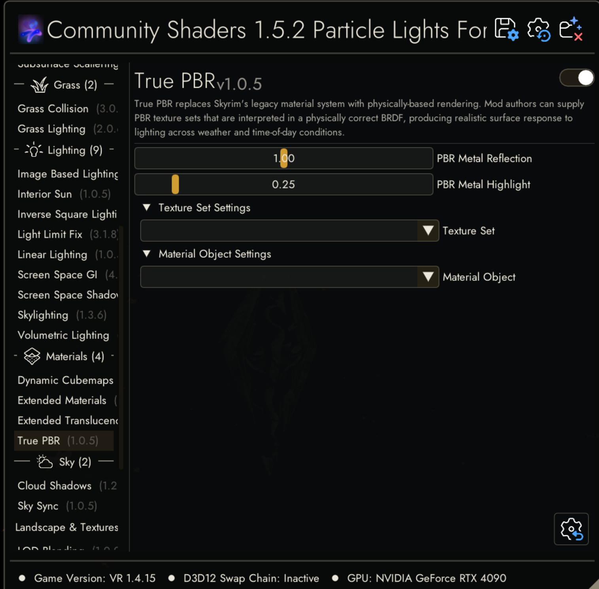

**True PBR** is an advanced material system. The main global controls shown here affect PBR metal reflections and highlights. The texture set and material object sections allow detailed per-material tuning such as displacement, roughness, specular level, subsurface, coat, and glint parameters.

Most users should leave this page at defaults unless a specific PBR material looks wrong. This is a powerful tuning page, but it is easy to over-correct.

#### Volumetric Lighting

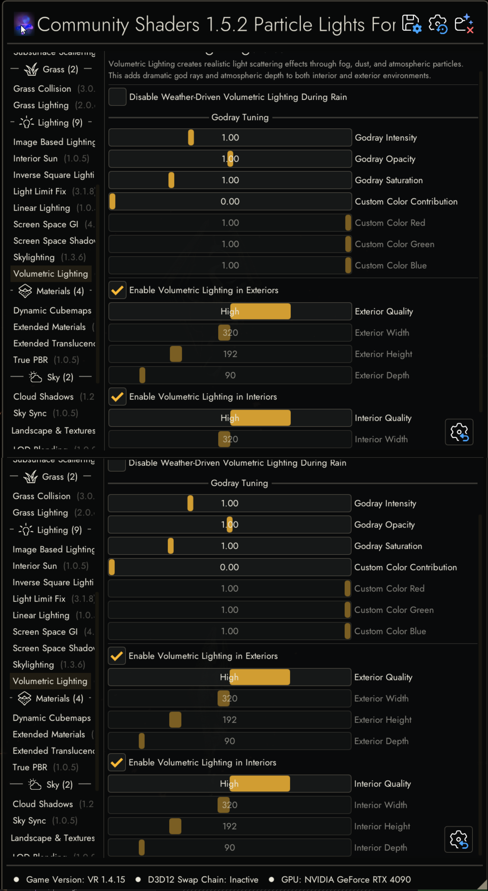

**Volumetric Lighting** controls godray intensity, opacity, saturation, custom color contribution, and separate exterior/interior quality and volume dimensions.

Higher quality and larger volume dimensions cost more. Use the tooltip ranges when tuning, and avoid pushing godray intensity/opacity too high because it can make weather lighting look washed out.

### Performance Optimization

The biggest VR performance saver is usually **FOV**, because the shared FOV mask can reduce the expensive center work for upscaling and can also be reused by later shader/detail FOV features. Set it up first in **VR > Foveation** with **Foveated Upscaling (FOV)** and **FOV Mask Visualization**. The mask setup is key: if the center mask or Peripheral TAA range is too large, later FOV savings become smaller; if it is too small, shimmer or visible transitions can appear.

Use the table below as a planning guide, not as a fixed benchmark. The numbers assume a demanding VR scene with the feature active. Measure your own result with the **Performance Overlay** in the same scene before and after each change.

For VR, treat **Screen Space GI** as an **AO-only** feature. Enable only the AO resources and leave GI/IL resources disabled unless you are deliberately testing the extra cost. AO gives the useful depth/contact effect in the headset; GI/IL is much more expensive and is usually not the right default for VR performance tuning.

#### Dynamic Rules with VR FPS Stabilizer

[VR FPS Stabilizer](https://www.nexusmods.com/skyrimspecialedition/mods/31392?tab=description) can be used on top of the manual setup. Its CS VR Fork API support allows Community Shaders settings to be changed through conditionals, performance levels, and location rules, including interior/exterior and weather-aware rules.

Use this after the FOV masks and normal culling settings are already tuned:

1. Use **DLAA** / **Native AA** or a high-quality upscaling preset in interiors and other light scenes.
2. Switch to **Quality**, **Balanced**, or **Performance** upscaling outdoors, in heavy cities, in heavy foliage, or when a location needs more headroom.
3. During rain, storm, or snow, disable expensive fine-detail effects that are less visible anyway: **SSGI**, **Screen Space Shadows**, and **Light Limit Fix Contact Shadows**.
4. Use location rules for known problem areas, level rules for general frametime pressure, and conditional rules for interior/exterior or weather-specific changes.

VR FPS Stabilizer uses its own config syntax, for example `CS>Setting=value`. Follow that mod's description for the exact file and rule format. The useful CS settings are **SSS**, **SSGI**, **VLExterior**, and **DLSSMode**.

The CS API names are technical. **SSS** means **Screen Space Shadows** here, not Subsurface Scattering. The legacy **DLSSMode** API name controls the shared upscaling preset for **DLSS**, **FSR 3.1.5**, and runtime **FSR4**; for FSR/FSR4 the DLAA/native preset behaves as **Native AA**. If a config rule uses numeric presets, the stable values are `0` DLAA/Native AA, `1` Quality, `2` Balanced, `3` Performance, and `4` Ultra Performance. This fork also defines `5` Hoshipa and `6` Ultra Quality for compatible configs, and exposes **Light Limit Fix Contact Shadows** through the API so a compatible dynamic config can switch contact shadows with the same scene/weather logic.

Conceptually, a dynamic profile can look like this:

```text
Interior / light scene:
Upscaling preset = DLAA or Native AA
SSGI = on
Screen Space Shadows = on
Contact Shadows = on

Exterior / heavy rain or storm:
Upscaling preset = Quality, Balanced, or Performance
SSGI = off
Screen Space Shadows = off
Contact Shadows = off
```

Keep FOV as the base performance saver. VR FPS Stabilizer is best used as the automatic layer above it: FOV reduces the work every frame, while dynamic rules decide which features should be active for the current interior, exterior, weather, level, or location.

For this table:

```text
All-on cost:
Estimated cost when the feature is active at visually strong settings.

Moderate saving:
Quality-first tuning. Uses FOV without hard cutoff, SSGI/Screen Space Shadows culling, and Wetterness still at Quality-like settings.

Maximum saving:
Performance-first tuning. Uses aggressive culling, smaller FOV areas, hard cutoffs where available, lower presets/resolution, or disabling a feature if needed.
```

| Feature | Estimated all-on cost | Moderate saving | Maximum saving | Options that save performance |
|---|---:|---:|---:|---|
| Shared VR FOV mask | Can save `0.8-3.5 ms` across FOV-capable features | `0.8-2.0 ms` | `1.5-3.5 ms` | **VR > Foveation**: **Foveated Upscaling (FOV)**, **FOV + Peripheral TAA**, **Upscaling FOV Area**, **Expand FOV Area R/L**, **TAA Peripheral Range**, shader/detail FOV toggles, hard cutoff variants |
| Light Limit Fix / Particle Lights | `0.5-1.2 ms`, scene dependent | `0.2-0.4 ms` | `0.5-1.0 ms` | **Enable Culling**, **Enable Optimization**, **Cluster Threshold**, **Max Particles per Emitter**, **Max Particle Distance**, **Enable Particle Contact Shadows**, **Cached Lights per Cluster**, **Particle Budget per Cluster**, **Strict Light Budget** |
| Terrain Blending | `0.3 ms` | `0.1 ms` | `0.2-0.3 ms` | **Terrain Depth Culling Distance**, lower **Blend Strength**, or disable **Enable Terrain Blending** if needed |
| Screen Space Shadows | `0.4 ms` | `0.15-0.25 ms` | `0.3-0.4 ms` | **Screen Space Shadows FOV**, **Shadow Cull Distance**, **Sample Count Multiplier**, **Baseline Samples**, **Enable**, VR FPS Stabilizer **CS>SSS** weather/interior/location rules |
| Screen Space GI, AO only | `1.0 ms` | `0.35-0.6 ms` | `0.7-1.0 ms` | Recommended VR mode: enable only AO resources. Use **SSGI FOV**, **AO Interiors Only**, **AO/IL Cull Distance**, **Adaptive Sampling**, **Half Res**, **Quarter Res**, **AO only** preset, **Enable**, VR FPS Stabilizer **CS>SSGI** rules |
| Screen Space GI, AO + GI | `1.4-1.8 ms` | `0.5-0.9 ms` | `1.0-1.5 ms` | Not recommended as a VR default. Disable **GI/IL** resources for AO-only mode; if testing GI anyway, use **GI Interiors Only**, lower **IL radius**, lower **IL Source Brightness**, and VR FPS Stabilizer **CS>SSGI** rules |
| Wetterness in heavy rain/storm | Up to `2.0 ms` | `0.4-0.8 ms` | `1.2-2.0 ms` | **Wetterness Preset** at **Quality** for moderate tuning, **Wetterness Dynamic Detail** in **VR > Foveation**, **Wetness Fade Range**, **Raindrop Effect Range**, **Enable Raindrop Effects**, **Enable Splashes**, **Enable Ripples**, **Puddle Radius**, **Shore Range**, lower preset or disable **Enable Wetterness** in worst cases |
| Subsurface Scattering | `0.3-0.5 ms` | `0.1-0.2 ms` | `0.3-0.5 ms` | **Burley Samples**, **Blur Radius**, **Thickness**, **Enable Character Lighting**, lower profile strength values |
| Grass Lighting | `0.1-0.3 ms` | `0.05-0.1 ms` | `0.1-0.2 ms` | **Detection Threshold**, complex grass glossiness/specular controls, **Wrapped Lighting for Vanilla Grass**, **Override Complex Grass Lighting Settings** if needed |
| Skylighting | `1.5 ms` | `0.4-0.8 ms` | `1.0-1.5 ms` | **Probe Grid Quality**, **Enable Reduced Update Frequency**, **Occlusion Update Interval**, **Probe Update Interval**, **Enable Incremental Probe Updates**, **Stable Slice Count**, **Enable Fast Probe Sampling**, **Max Zenith Angle**, or disable the feature |
| True PBR | `0.2-0.5 ms`, material dependent | `0.05-0.2 ms` | `0.2-0.5 ms` | Lower **PBR Metal Reflection** / **PBR Metal Highlight**, avoid expensive **Glint** settings, reduce displacement/coat/subsurface values, or disable if a material setup is too expensive |
| Volumetric Lighting | `0.4-0.9 ms` | `0.2-0.4 ms` | `0.5-0.9 ms` | **Exterior Quality**, **Interior Quality**, custom **Width / Height / Depth**, **Disable Weather-Driven Volumetric Lighting During Rain**, **Enable Volumetric Lighting in Exteriors/Interiors**, VR FPS Stabilizer **CS>VLExterior** rules |
| Cloud Shadows | `0.3 ms` | `0.1-0.2 ms` | `0.3 ms` | Disable if you need easy savings; Skyrim VR already has many imperfect shadows |
| Estimated subtotal, AO only, heavy rain | `7.0-8.9 ms` | `2.1-4.0 ms` | `5.3-8.3 ms` | Do not add the FOV row again; some savings overlap because FOV, culling, weather state, and feature toggles interact |

The table values are roughly additive only as a first approximation. Some savings overlap because several features reuse the same FOV mask or are active only in certain weather/cell conditions. For example, Wetterness matters most in rain, Skylighting matters when enabled outdoors, and Particle Lights depend heavily on the number of active fire/magic/particle effects.

Recommended tuning order:

1. Set up **Foveated Upscaling (FOV)** correctly in **VR > Foveation**.
2. Enable moderate FOV users first: **Screen Space Shadows FOV**, **SSGI FOV**, and shader/detail FOV toggles.
3. Tune culling before lowering quality: **Shadow Cull Distance**, **AO/IL Cull Distance**, **Terrain Depth Culling Distance**, **Max Particle Distance**, and **Wetness Fade Range**.
4. Keep **Screen Space GI** in AO-only mode for VR, with only AO resources enabled.
5. Lower heavy feature quality only after culling/FOV are working: **Probe Grid Quality**, **Wetterness Preset**, **Resolution Mode**, **Burley Samples**, and volumetric quality.
6. Disable whole features last if the table shows they are still too expensive for your target frametime.

**Image Based Lighting** is not fully ready for general use yet. **Linear Lighting** is intended for future post-processing presets. Both are core features, but I usually disable them for now.

To unload a feature, toggle the upper-right feature switch off, save, exit, and restart the game. The setting is saved in your CS configuration.

### Complex Material: Ice Mesh Wobble

If you see ice meshes wobbling, especially ice cliffs behind Winterhold changing colour from bright to dark while you move toward them, disable:

```text
Enable Complex Material
```

This was needed in MGO 3.66. I am not sure if it is still required in MGO 3.88.

---

## Final Notes

Before playing, confirm:

- Make sure old overwritten CS feature mods are disabled.
- Make sure SKSE VR Address Library is updated.
- Update Light Placer and Light Placer VR only if required.
- Clear the shader cache.
- Start Skyrim VR through MO2.
- Let shader compilation finish fully before loading into the game.
- Press **END** to adjust Community Shaders settings in game.

Once everything is compiled and configured, you are ready to play.
