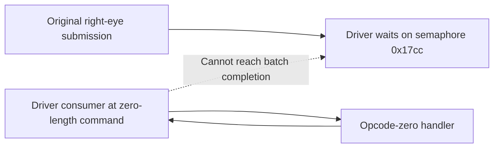

> Historical report, privacy-filtered for this export. Statements about
> current process state and planned work describe the original session.
> See the bundle README for later findings and omitted source files.

The third COC froze Skyrim VR in the NVIDIA user-mode driver command queue.
Ghidra confirms a zero-length command prevents the queue consumer from
advancing. Skyrim's main thread waits for that queue during the original
right-eye OpenVR submission. A later noninvasive WinDbg sample confirms the
same command, batch and wait chain remain in place.

The shadow journal also exposes a native shadow-light lifetime defect on
the frozen frame. A background thread finishes destroying a light while
the main thread is rendering it; the native render function subsequently
reads that light's descriptor count. The evidence does **not** establish
which code wrote the malformed driver command, or prove that this lifetime
defect caused it.

The requested diagnostic used 20 alternating COCs with a 5,000 ms wait
before each dispatch. It stopped after three dispatches and two strict
completions. These timings include active shadow-lifetime instrumentation
and are diagnostic observations, not a performance qualification.

| Transition | Route                             | Strict completion        | Result                                      |
| ---------- | --------------------------------- | ------------------------ | ------------------------------------------- |
| 1          | Dragonsreach → WindhelmExterior01 | 9,235.9847 ms; 35 frames | Stable                                      |
| 2          | WindhelmExterior01 → Dragonsreach | 4,362.1245 ms; 43 frames | Stable                                      |
| 3          | Dragonsreach → WindhelmExterior01 | Not reached              | Strict timeout at 30,000.7581 ms            |
| 4          | Intended return to Dragonsreach   | Not dispatched           | Admission failed with `main_thread_timeout` |
| 5–20       | Remaining alternating routes      | Not run                  | Scenario aborted after the control failure  |

Scenario run 2 executed 13 of 80 steps in 63,772 ms. All three observed
pre-dispatch waits were exactly 5,000 ms. Transition 3's waiter returned
an observation with `strictSatisfied=false`; the following admission failed
after 5,001 ms and stopped the scenario. No fourth COC was dispatched.
The complete, unabridged receipts and explicit missing-result reasons are
in [transition-results.json](transition-results.json) and
[scenario-result.json](scenario-result.json).

In PID 22880, main thread `0x2014` waits on semaphore `0x17cc` at
`nvwgf2umx+0x598859`. The stack runs through `vrclient_x64+0x14d998`
and the original submission call at `InSceneOverlay.cpp:972`, called
from line 1747. The retained submit packet is marked valid and DirectX,
with texture and bounds present. Its `captureError=66` field is an
initial default and is not a returned compositor error: submission has
not returned.

NVIDIA worker `0x8b34` consumes a batch from `0x1ba3e8fe400` to
`0x1ba3e905fd0`. Walking the captured batch finds 1,354 valid commands,
then opcode `0`, length `0`, at `0x1ba3e904710`. Ghidra's decompilation
of `nvwgf2umx+0x598370` computes the next cursor as the current cursor
plus four times the command length. The zero length leaves it unchanged.
Completion accounting and semaphore notification occur after this loop.
The opcode-zero handler is `nvwgf2umx+0x2ec840`; the worker was sampled
inside its downstream buffer-reservation path, which includes `SleepEx`.

At 12:11:42 UTC, a second WinDbg sample found the same command header,
batch bounds and stack path. The main wait counter had increased from
519 in the dump to 1,455. The worker had accumulated 1,521.3125 seconds
of total CPU time immediately before that sample. This corroborates
the persistent queue failure rather than a transient wait.
The consumer's 918 bytes and opcode-zero handler's 266 bytes are
identical to the preserved code from PID 60840's earlier hang.
The installed driver version is `32.0.16.1088`.

See [Ghidra driver output](ghidra-investigation/nvidia-frozen-ghidra.txt),
[decoded queue](ghidra-investigation/driver-command-queue.json),
[code comparison](ghidra-investigation/previous-driver-code-comparison.json),
[dump stacks](inspect-frozen.log), and [live confirmation](confirm-live-hang.log).

The new lifetime finding concerns light `0x1ba8124b900`, generation 28,
frame 23775, transition 3. Render thread `0x2014` entered with reference
count 1. Cleanup thread `0x6b04` entered destruction with reference
count 0 via the native queue-drain path at `SkyrimVR+0x12f7c3e`.

| Event                               | Sequence | Milliseconds after light-render entry |
| ----------------------------------- | -------- | ------------------------------------- |
| Light rendering begins              | 274537   | 0                                     |
| Second descriptor rendering begins  | 274562   | 4.5794                                |
| Accumulator rendering begins        | 274563   | 4.5910                                |
| Background light destruction begins | 274564   | 5.8662                                |
| Second descriptor destruction ends  | 274582   | 5.9873                                |
| Light destruction ends              | 274583   | 5.9963                                |
| Accumulator rendering returns       | 274616   | 6.5744                                |
| Second descriptor rendering returns | 274625   | 6.6263                                |
| Light rendering returns             | 274626   | 6.6271                                |

Ghidra shows `SkyrimVR+0x137140c` executing
`CMP EDI,dword ptr [RBX+0x140]` after descriptor rendering returns:
it reads the destroyed light's descriptor count. The light destructor
also destroys and releases the descriptor array. Destruction ends
0.6308 ms before light rendering returns. Physical allocation freeing
time is not separately logged; the evidence establishes use after
destruction, not its exact allocator-free time. The accumulator itself
survives: generation 30 is not destroyed during this overlap, and its
observed reference count changes from 3 to 1.

The next implementation investigation should cover ownership of the
native shadow-render consumer across queued cleanup. Existing LLF scene
snapshots protect their own consumers but do not establish that this
native render call retains the light. Capturing the write that creates
the bad command remains necessary to connect the lifetime defect to the
driver hang. No source fix, build, deployment or restart was performed.

See the [complete overlap timeline](shadow-overlap-timeline.json),
[journal decoder summary](events.summary.json), and
[native Ghidra output](ghidra-investigation/native-original-ghidra.txt).
Native entry bytes were restored only in a separate offline analysis
file, from matching captured Detours trampolines with verified return
addresses. The original bytes and reconstruction receipt are preserved.
The game was not patched for this analysis.

The exact producer is Build ID
`e2fe386c8a467b1350165159286f746549f9f6883a51d5c23a2a37f8660ee75b`,
source `8dcc88204ab4d6f871ef829ade4b9b6e40924636` with dirty digest
`e04eb5fc2e988116bc4ee16dd1c920b6ac780ebb61de9a293f2740bed5d808d4`.
The enabled physical AIO DLL, adjacent manifest, AIO build receipt and
runtime producer agree. DLL size is 28,760,576 bytes; SHA-256 is
`5b8bc865708542580bd891d1d613198922db2ac9e29ece26ab5e4bdef46470fa`.
The exact DLL, PDB, manifest and receipt are preserved under `producer/`.

The current full dump is retained at
`dump/SkyrimVR-22880-confirmed-hang.dmp`, 26,156,111,707 bytes,
SHA-256 `d2deff52c287054b3d282a44722f554660c70821949e547c4ebebdbacd3334ac`.
It was captured noninvasively without suspending the target, so it is
not an atomic snapshot across all threads. The later live sample
corroborates the queue state. The shadow snapshot contains all 274,638
retained records with no gaps, overwrites, drops or read failures.
There were 258,753 generation misses, but the reported light has a known
generation. No relevant exception was recorded. The journal remained
active, with zero writers and stable headers during copying; orderly
stop/flush was not confirmed because the main thread was frozen.

The Ghidra MCP managed session could not start. Installed Ghidra 12.1.2
headless completed the driver, SteamVR and native analyses and saved
their projects locally. All WinDbg attachments detached successfully.
The game remains frozen; the scenario is aborted, and no new main-thread
commands were issued after the confirmed failure. The two controller
adapter issues are recorded in the local automation feedback queue as
`AUTO-20260912-114648629-00220806` and
`AUTO-20260912-114736157-BFBF62F4`.

Three obsolete full dumps were deleted at the user's request: the
PID 60840 and PID 5236 hang dumps, plus the September 11 WinDbg AV dump.
This freed 80,900,943,234 bytes (75.34 GiB). Their extracted code, Ghidra
projects, journals and analysis outputs remain available. Exact paths
and confirmed deletion results are in
[obsolete-dump-deletion.json](obsolete-dump-deletion.json) and
[obsolete-windbg-dump-deletion.json](obsolete-windbg-dump-deletion.json).

[analysis-summary.json](analysis-summary.json) contains the machine-readable
findings and complete transition records.
analysis-artifact-index.json (excluded from this export; see the bundle README) records hashes
for the principal analysis artifacts. The finalizer audited all 20
transition classifications, exact measured timings, identity matches,
queue parsing, native post-call read, debugger detachment, retained dump
size and deletion results. No code tests were run for this forensic task.
